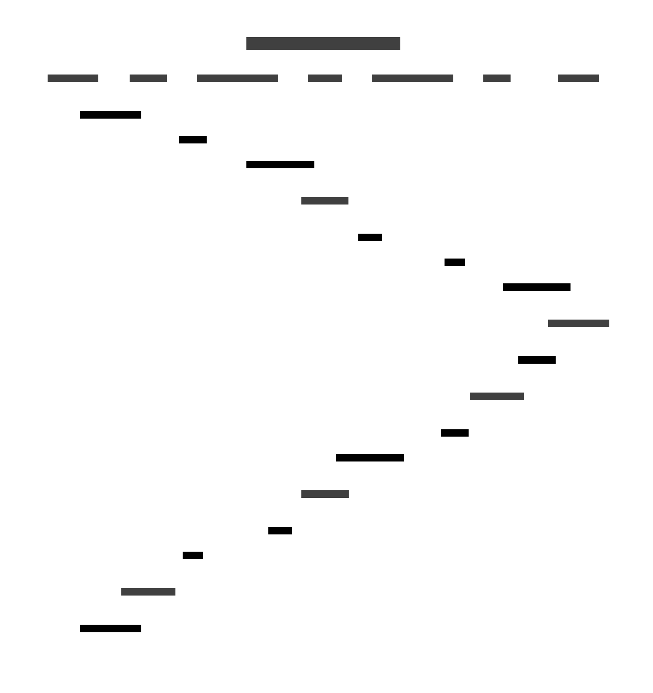

<div align="center" style="text-align: center; padding: 20px">
  
</div>

---

> A Layer 2 Rollup Solution for Decentralized Verifiable Random Functions

🚀 Random VRF Example App: https://app.random-network.org/

🚀 Explorer: https://testnet.random-network.org

🚀 RPC: http://167.172.174.224:8547

## 📖 Overview

**Random Network** is a specialized Layer 2 rollup **built on Arbitrum Orbit** that provides secure, verifiable randomness for decentralized applications. By **leveraging the Espresso Network** architecture, we've created a scalable **VRF (Verifiable Random Function)** solution that maintains the security guarantees of L1 while offering improved performance and cost efficiency.

## 🚀 Features

- **Decentralized Randomness**: Truly unpredictable and tamper-resistant random number generation
- **L2 Scalability**: Lower costs and faster confirmation times than L1-based VRF solutions
- **Cross-Chain Compatibility**: Use our VRF service from multiple networks
- **Verifiable Results**: Cryptographic proofs ensure integrity of random number generation
- **Developer-Friendly**: Simple integration for dApps needing secure randomness


## How It Works

<div align="center">



</div>

## 🔧 Architecture

Random Network consists of several key components working together to provide secure, verifiable randomness:

1. **[VRF Core](./contracts/vrf-core/src/VRFCoreV1.sol)**: The central randomness generation service deployed on Random Network rollup that:
   - Receives randomness requests via Hyperlane's cross-chain messaging protocol
   - Manages request lifecycle from receipt to execution
   - Validates VRF proofs before sending results back to the requesting chain

2. **[VRF Request](./contracts/vrf-request/src/VRFRequestV1.sol)**: The client-side contract deployed on supported chains that:
   - Allows dApps to request randomness by sending a message to the VRF Core
   - Receives and verifies randomness results from the VRF Core
   - Forwards verified random values to the requesting contracts
   - Supports payment for randomness services via native token transfers

3. **[VRF Verification Library](./contracts/vrf-verification-library/src/VRFVerificationLibraryV1.sol)**: Cross-chain cryptographic verification system that:
   - Ensures the integrity of random values through cryptographic proofs
   - Provides a common verification standard across all supported chains

4. **Rollup Infrastructure**: Arbitrum Orbit-based L2 powered by Espresso Network that:
   - Processes VRF requests with high throughput and low latency
   - Maintains security guarantees through the Espresso Network's consensus mechanism
   - Provides a dedicated environment optimized for randomness operations

5. **Hyperlane Integration**: Cross-chain messaging system that:
   - Enables secure communication between different blockchains
   - Handles message routing and delivery between the VRF Request and VRF Core contracts
   - Provides interchain security modules for message verification

6. **Open Intents Framework**: Open-source framework that:
   - Enables Hyperlane cross-chain messaging solver

7. **VRF Executor Service**: Off-chain service that:
   - Monitors for new randomness requests
   - Generates cryptographic proofs for random values
   - Submits proofs to the VRF Core contract for validation

## 📝 Usage

### Requesting Randomness

To integrate Random Network's VRF service into your smart contract, implement the randomness consumer interface and follow these steps:

```solidity
// Example Solidity Integration

// Interface for receiving randomness callbacks
interface IRandomConsumer {
    function receiveRandomness(bytes32 requestId, uint256 randomness) external;
}

contract MyGame is IRandomConsumer {
    // The VRF Request contract on your chain
    VRFRequestV1 public immutable VRF_REQUEST;
    
    uint256 public randomResult;
    bytes32 public lastRequestId;
    
    constructor(address vrfRequestAddress) {
        VRF_REQUEST = VRFRequestV1(vrfRequestAddress);
    }
    
    // Request randomness by sending a transaction with ETH payment
    function requestRandomNumber() external payable {
        // Optional parameters can be passed to influence randomness generation
        bytes memory parameters = "";
        
        // Specify gas limit for the callback function
        uint256 callbackGasLimit = 100000;
        
        // Forward ETH payment with the request
        lastRequestId = VRF_REQUEST.requestRandomness{value: msg.value}(
            parameters,
            callbackGasLimit
        );
    }
    
    // Callback function that receives the verified random value
    function receiveRandomness(bytes32 requestId, uint256 randomness) external override {
        // Verify the sender is our trusted VRF contract
        require(msg.sender == address(VRF_REQUEST), "Unauthorized VRF fulfillment");
        require(requestId == lastRequestId, "Unknown request ID");
        
        // Store and use the randomness
        randomResult = randomness;
        
        // Your game logic using the random value
        // e.g., mintRandomNFT(randomness);
    }
}
```

## 📊 Contract Deployments

### Rollup Infrastructure

**Rollup Hash**: `0xee1608426e90e7e6be3bc624412913ba51913e92422a46b2d341cc3287788983`

| Contract | Address |
|----------|----------|
| RollupProxy | `0x51eCf345dC279b8933754A9541A7f3F46e2588F9` |
| Inbox (proxy) | `0x2EBA5958Fe4f2b048CFCf901033f7b245d8F6Cc7` |
| Outbox (proxy) | `0x72703FDF652af65E540A888f6540A92E49C35C60` |
| rollupEventInbox (proxy) | `0x388301F428596b9EC1912E7DBD6Dd4E13f0bDaBe` |
| challengeManager (proxy) | `0xCA5d70851bfee1E7e0b872A43292e8660f9B60AA` |
| AdminProxy | `0x3B3524742488e22Be24F871eA8ec868E4f76f5BA` |
| SequencerInbox (proxy) | `0xDA86cb34DA3441363aEB33ed5e0AE00DaA85D2e2` |
| Bridge (proxy) | `0x123d4366000f68Df709B86e6E017499c5236C66E` |
| ValidatorUtils | `0x22d70A6bBA034d86E7d9f548Abd71D819AE19D41` |
| ValidatorWalletCreator | `0x026AeAc2B3929D362D88D6Af57A88bC85BbAaeA5` |
| EthBridge | `0xd596372b7E9a482349dffA3Bd2cCEa74687eD42e` |
| EthSequencerInbox | `0xC2411397Ad13e467262161803418df537F64389b` |
| EthInbox | `0x4016546b61348Ee9a662B700e767Db0265DC0d98` |
| EthRollupEventInbox | `0xcaB6ab37aA8E4F7B2486f4C285e489106f78F256` |
| EthOutbox | `0xa8b998386A457b3F00225552293B70517E4F5497` |
| ERC20Bridge | `0x42C51958D80DB2EdbA18765FD50f5BC6a69716c2` |
| ERC20SequencerInbox | `0x23534e3611933cfA9551571859E090F930fb99ab` |
| ERC20Inbox | `0x897a589Ac7F0613ED2F226c8092b6B60C226d8D1` |
| ERC20RollupEventInbox | `0x36999201046fdf055aF4AB7FdA7E9720c6fDCBaf` |
| ERC20Outbox | `0x4E33FEFeFAD3eE2FAfBE322E461C67bafA8157FD` |
| BridgeCreator | `0xd596372b7E9a482349dffA3Bd2cCEa74687eD42e` |
| OneStepProver0 | `0xA2475685bfBd5298A407844ab722b88204B18DcC` |
| OneStepProverMemory | `0x44b638734c7FE517b4aAfD186e84efAB90ae40a5` |
| OneStepProverMath | `0x949c904B885B8D1b13933C823DF434595BFBCfDB` |
| OneStepProverHostIo | `0x435570f523670d603946131A6A7444E48dB97163` |
| OneStepProofEntry | `0x2B4cE145fC38e0927f2736b1D5E95c53969f0519` |
| ChallengeManager | `0xfbc8bC77DE05BEA86914F2dAF871da250Effa9c7` |
| RollupAdminLogic | `0x5cb012C74eEDDe07d9A83cDf58fE056B9849cdE4` |
| RollupUserLogic | `0xcEc9aB9e49302aC80D86F60Ce985ce95904EA76a` |
| UpgradeExecutor | `0x54c562a3eeaBAb576c41bdD9Da9378480Ed5d851` |
| RollupCreator | `0xbCe8253fdB570Aa720EEdAB36ffa80E9b0c79A3D` |
| DeployHelper | `0x71DFd511e3485E9D43965FeCaE23BAF9886192fa` |

*All deployed at block number: **130502855***

### VRF Core

- **Random Testnet**: `0x9bF90104DC52b645038780f5e4410eC036DD273d`

## VFR Request

- **Arbitrum Sepolia**: `0x9A0766d9730Ae0F17e81143C8A632b3DCA613CD4`

### VRF Verification Library

- **Arbitrum Sepolia**: `0xAB6729F68CECD58D718693d98108AaaE0bf72b2A`
- **Random Testnet**: `0x90C95CD5980001b55EE0e54845d0daa9dA93d64E`


### Hyperlane Deployments

| Contract | Address |
|----------|----------|
| staticMerkleRootMultisigIsmFactory | `0x6C19EF91b1b667564061cAf2deAeCCec1cb21528` |
| staticMessageIdMultisigIsmFactory | `0xd4Ab8cE19F14B568F427ABcF6a6732BaB21d1F53` |
| staticAggregationIsmFactory | `0x2232Ac960039A7bd28B2e7f90DEd13D07c2c2431` |
| staticAggregationHookFactory | `0x4A287617018DB41c1B1842039ecd5146f3968fCb` |
| domainRoutingIsmFactory | `0xC8e22f7975709324dC33d7De3485C4D0ca3BD73f` |
| staticMerkleRootWeightedMultisigIsmFactory | `0xf7323B5B7C787e8b2ADd02541C5275C8d39FD4B8` |
| staticMessageIdWeightedMultisigIsmFactory | `0x68bb78F5c7e46829352A2Dc5a81d99b7BE9C38ed` |
| proxyAdmin | `0x27E0Df343B726a12A865C2fB6811ED43417Db3Db` |
| mailbox | `0xbE431E0aaEFeC6Ce80071498bCbEd0452011DC41` |
| interchainAccountRouter | `0xa32b75c9fDa860C4aafd0DA3Bb6139a0c0a90621` |
| interchainAccountIsm | `0xa057712A9f509d8af15979836e300e32FE4da7EA` |
| validatorAnnounce | `0x3572108CF85Bb29f20B429028008F672ac76E86A` |
| testRecipient | `0x8af0Bbb1a7399C17143f825aa4A3109224f4dE4E` |
| merkleTreeHook | `0x88b6F46847461F11831E4f527Cd9cd96a09f842C` |

## 📄 License

This project is licensed under the MIT License - see the LICENSE file for details.

---

*Built for the Espresso Network Hackathon 2025*